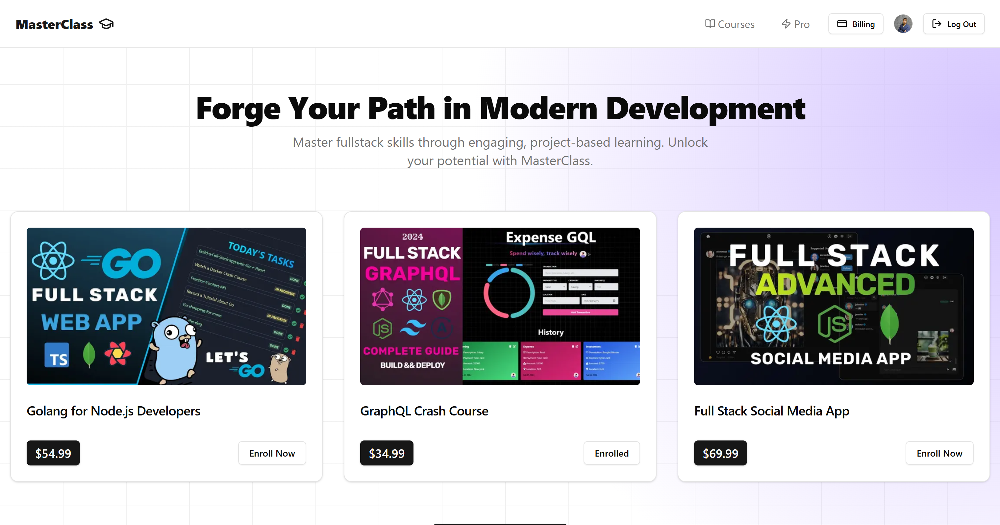

<div align="center">
</div>

<div align="center">
<a href="https://github.com/terzievdimitar/stripe-subscriptions" target="blank">

</a>

<h2> Project Name : MasterClass - Stripe Subscriptions </h2>




</div>

## 💡 Overview

MasterClass is a subscription-based online learning platform built with Next.js, Stripe, and Convex. It offers premium courses taught by industry experts, featuring exclusive content, live Q&A sessions, and community features. Designed for seamless user experience and payment integration.

## ✨ Features

- **🔐 User Authentication:** Secure login with personalized access levels.
- **💳 Stripe Integration:** Manage subscriptions, billing, and payments effortlessly.
- **📚 Course Management:** Access premium courses with Pro plans.
- **📄 Email Notifications:** Automated emails for purchases and subscriptions.
- **🎯 Production Optimization:** Built for speed and reliability in production environments.
- **📱 Responsive Design:** Access on any device with adaptive design.

Whether you're a solo learner or part of a team, MasterClass is the perfect tool for unlocking your potential. 🚀

## 👩‍💻 Tech Stack

- **Next.js**: A React framework for building server-side rendering and static web applications.
- **Clerk.js**: Authentication and user management.
- **Convex**: Backend-as-a-service for real-time data.
- **Stripe**: Payment processing and subscription management.
- **Tailwind CSS**: Utility-first CSS framework for styling.
- **React Query**: Data-fetching library for managing server-state in React applications.

## 📦 Getting Started

To get a local copy of this project up and running, follow these steps.

### 🚀 Prerequisites

- **Node.js** (v20.x or higher) and **npm** or **yarn**.
- **Stripe Account** for payment integration.

## 🛠️ Installation

1. **Clone the repository:**

      ```bash
      git clone https://github.com/terzievdimitar/MasterClass.git
      cd MasterClass
      ```

2. **Install dependencies:**

      Using Npm:

      ```bash
      npm install
      ```

3. **Set up environment variables:**

      Create a `.env.local` file in the root directory and add the following variables:

      ```env
        # Deployment used by `npx convex dev`
        CONVEX_DEPLOYMENT=

        NEXT_PUBLIC_CONVEX_URL=

        # Clerk configuration
        NEXT_PUBLIC_CLERK_PUBLISHABLE_KEY=
        CLERK_SECRET_KEY=

        # Stripe configuration
        STRIPE_SECRET_KEY=
        STRIPE_WEBHOOK_SECRET=

        STRIPE_MONTHLY_PRICE_ID=
        STRIPE_YEARLY_PRICE_ID=

        # Upstash Redis configuration
        UPSTASH_REDIS_REST_URL=
        UPSTASH_REDIS_REST_TOKEN=

        # Next Public URL

        # Resend API Key for sending emails
        RESEND_API_KEY=

        NEXT_PUBLIC_APP_URL=
      ```

4. **Run the development server:**

      ```bash
      npm run dev
      npm convex dev
      ```

## 📖 Usage

### ✔ Running the Website

- **Development mode:** `npm run dev`, `yarn dev`, or `bun dev`.
- **Production mode:** `npm run build && npm start`, `yarn build && yarn start`, or `bun run build && bun start`.

> Open [http://localhost:3000](http://localhost:3000) to view the app in your browser.

### 📃 API Documentation

The MasterClass API provides endpoints for managing users, subscriptions, and courses. Below is a summary of the available endpoints:

#### **Authentication**

- **POST /api/auth/login**: Authenticate a user and return a session token.
- **POST /api/auth/register**: Register a new user.
- **POST /api/auth/logout**: Log out the current user.

#### **Users**

- **GET /api/users**: Retrieve a list of all users.
- **GET /api/users/:id**: Retrieve details of a specific user.
- **PUT /api/users/:id**: Update user information.
- **DELETE /api/users/:id**: Delete a user.

#### **Subscriptions**

- **POST /api/subscriptions**: Create a new subscription.
- **GET /api/subscriptions**: Retrieve all subscriptions.
- **GET /api/subscriptions/:id**: Retrieve details of a specific subscription.
- **PUT /api/subscriptions/:id**: Update subscription details.
- **DELETE /api/subscriptions/:id**: Cancel a subscription.

#### **Courses**

- **GET /api/courses**: Retrieve a list of all courses.
- **GET /api/courses/:id**: Retrieve details of a specific course.
- **POST /api/courses**: Add a new course (admin only).
- **PUT /api/courses/:id**: Update course details (admin only).
- **DELETE /api/courses/:id**: Delete a course (admin only).

#### **Webhooks**

- **POST /api/webhooks/stripe**: Handle Stripe webhook events for subscription updates and payments.

## 📜 License

Distributed under the MIT License. See [License](/LICENSE) for more information.
